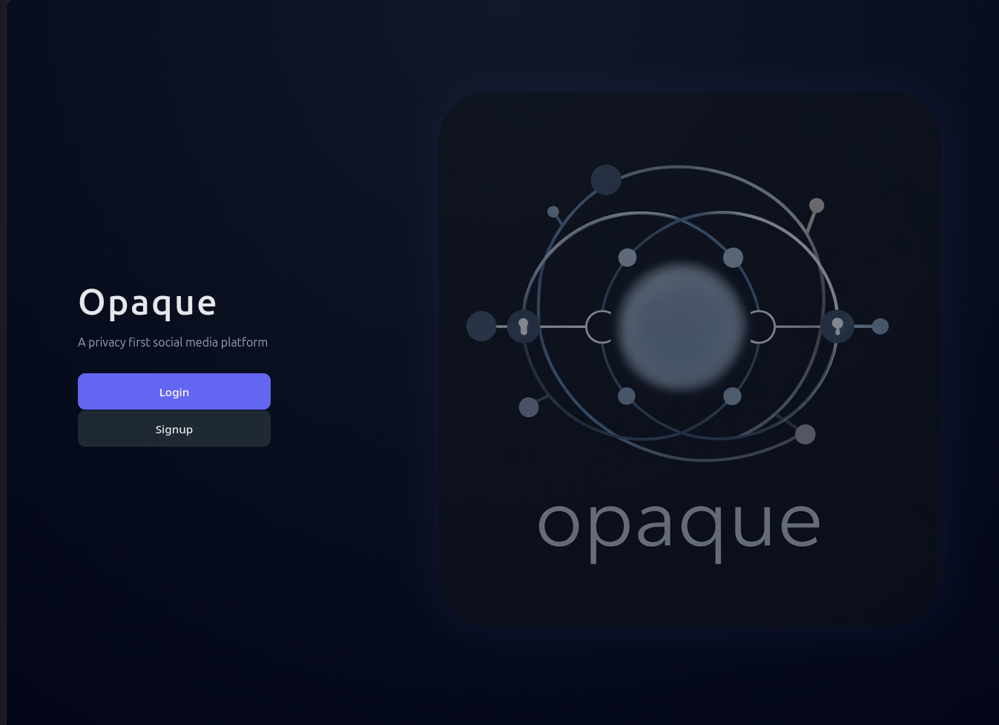
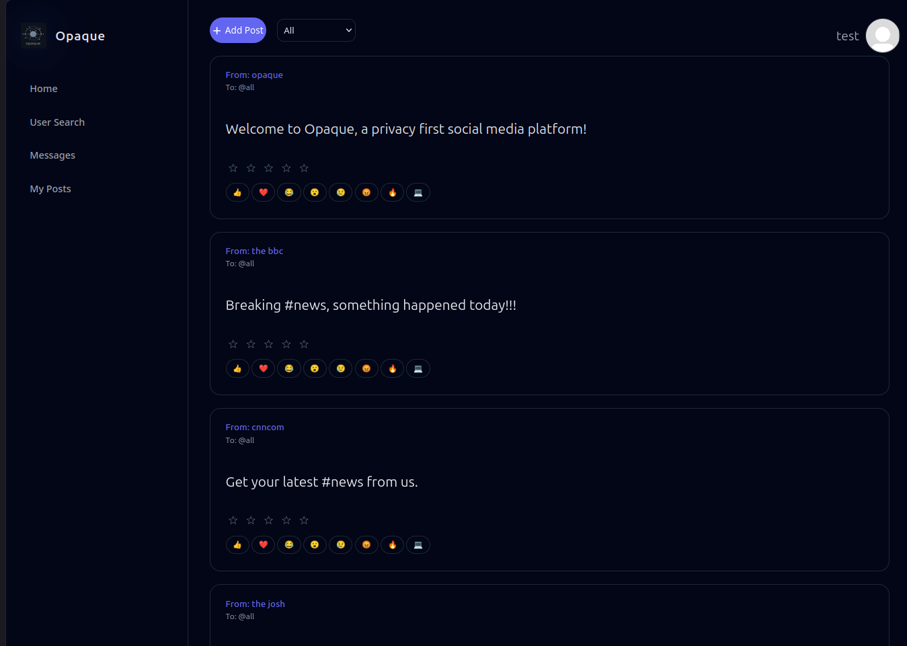
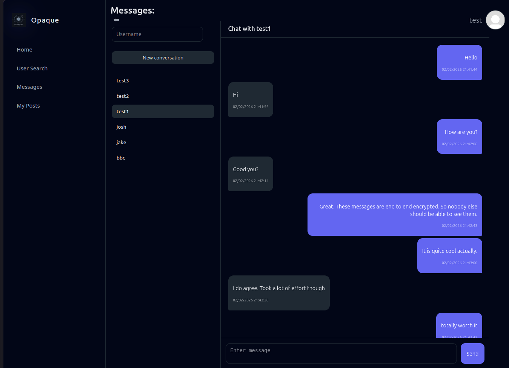
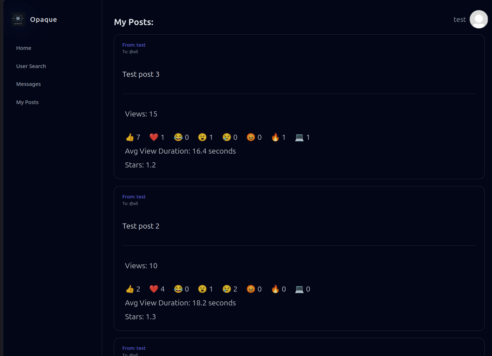

# Opaque
**A privacy-first social media platform**

Opaque is a full-stack social media platform built to explore the real-world applications of privacy preserving computing.

The platform combines social media functionality with homomorphic encryption, differential privacy and end-to-end encryption, allowing for features such as post analytics and private messaging while minimising the amount of sensitive information that is exposed to the server.

This project was designed and developed as part of my A-Level Computer Science NEA coursework.

## Screenshots
Homepage: 
 
Feed: 
 
Direct messages: 
 
Analytics: 
 

## Features
- Real-time social media feed using WebSockets
- User login and registration system
- Password based authentication
- User profiles with custom profile pictures and display names
- Creating and posting both text-based and image-based content
- Post visibility settings (public or restricted)
- Following and friendship system
- Username search with a trie-based autocomplete
- Social graph to store and represent friendships and relationships
- Mutual friend discovery using graph traversal
- Feed filtering by:
  - All posts
  - Following
  - Friends Only
  - Newest
  - Best Rating
  - News
- End-to-end encrypted direct messages between users
- Client-side key generation and encrypted key storage - not even the server can see user private keys
- Image upload system with validation, sanitisation and sensitive metadata removal
- Privacy-preserving post analytics including:
  - View count
  - Average view duration
  - Reactions
  - Average star rating / 5
- Homomorphic encryption for privacy-preserving post analytics
- Differential privacy for aggregate post ratings
- SQL database for user logins, profiles, posts, messages, analytics and relationship connections
- Server-side access controls based on permissions and ownership
- Dynamic single-page web interface

## Privacy
Privacy was a central design goal of Opaque. 
These are some of the ways this was achieved:

### Key management
When a new user registers to the platform, several public private keypairs are generated for different features, including direct messaging and privacy-preserving analytics.

Before storing this data on the server, the client derives a user-specific AES key from the user's login password and the account's salt. This forms the 'master key' which is used to securely encrypt all private keys before transmitting and storing them on the server.

When the user logs in again, the client derives the same master key using their password and account salt, retrieves the encrypted private keys from the server and decrypts them locally.

Since the user's password never leaves the client in plaintext, the plaintext private keys are only accessible by the client.

### End-to-End Encryption
Each user generates a public private RSA keypair on signup. 
When a user wants to send a message to a recipient, the client automatically requests the recipient's public key from the server and then uses it to encrypt the message content.

Since the recipient is the only one with the respective private key, only they are able to decrypt the direct message and so the message can be sent securely without even the server being able to read the content.

Additionally, so that sender can also view conversation history, a sender's copy of the message is also produced by encrypting the message with the sender's public key.

### Homomorphic Encryption
Post analytics are designed so that the server can maintain an aggregate count of statistics without needing to access the actual plaintext values.

Homomorphic encryption allows for certain operations to be performed directly on encrypted data without the need for decryption. Opaque uses for both reactions and view duration, allowing these to be collected while hiding the values from the server.

Reactions are stored as a large integer where different blocks of powers of 10 (e.g. 10^9 -> 10^5) represent a count for different pre-defined reactions. Average view duration is done using total view duration and view count.

Every time one of these metrics is updated by a client, the appropriate number (either that client's view duration or the appropriate power of ten for the selected reaction) and additional noise (to prevent know plaintext bruteforce) is encrypted by homomorphic encryption and then, under the homomorphic system, added to the already encrypted existing data to produce the new incremented data.

As a result, the client cannot see any existing metrics and the server cannot see the existing metrics or what each client provided.

Only the owner of the post can decrypt these metrics using their private key.

This project used the paillier cryptosystem through the paillier-bigint library.

### Differential Privacy
Star ratings use differential privacy to build up a representative average rating of a post's score while minimising the amount of information that can be inferred about an individual user's rating.

Instead of directly adding each user's rating to the total, cryptographic noise is added to each individual contribution. 
This is done through sampling a Laplace distribution with cryptographic randomness. 
This noise is designed to cancel out on average as more users rate a post.

This project implements both the differential privacy and the Laplace distribution used by it. 
Parameters were picked after testing such that after around 10 votes, the average rating is mostly representative of the true rating. This works well for the demo but can be changed to increase privacy further.

## Architecture
Opaque is split into a client and server model communicating over a WebSocket connection.

The server is responsible for:
- User authentication and session management
- Database access
- Access control
- Post and message distribution
- Image storage
- Social graph operations
- Real-time communication between connected clients

The client handles:
- User interaction and presentation
- Post creation and feed rendering
- Image processing before upload
- Cryptographic key generation
- Encryption and decryption
- Tracking post viewing behaviour
- Updating the privacy-preserving analytics metrics
- Communicating with the server through the WebSocket API

## Author
### Daniel Weglowski
Opaque was designed and developed by me during Sixth Form as part of my A-Level Computer Science NEA coursework

## License
Copyright (c) Daniel Weglowski. 
Licensed under the [MIT](LICENSE.md) license